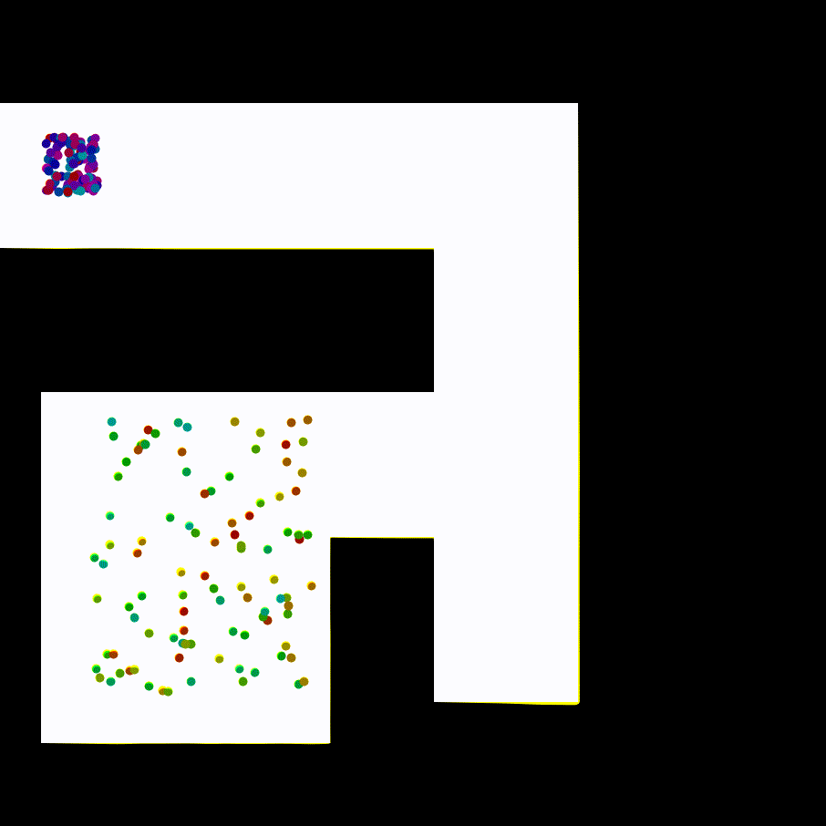

# Occ-Traj120

Occ-Traj120 is a trajectory dataset that contains occupancy representations of different local-maps with associated trajectories. Thise dataset contains 400 locally-structured maps with occupancy representation and roughly around 120K trajectories in total.

<p align="center">
    
    
    
</p>

## Dataset contents

<div>
    <p>
    There is a wide range of trajectories within a given map, and each one of them has a different number of time-steps and travel distance.
    </p>
    <p align="center">
        
        </p>
    <p>
    The dataset also contains trajectories that might not be an optimal path and diverged from one other.
    This fact is shown from the diverse range of distribution in distribution plots.
    The followings are a few statistical plots of the trajectories within the dataset.
    </p>
</div>

<p align="center">
    
</p>

## Dataset format details

Each file name in the `dataset/` folder are in the format of
```
occtraj_$MD5_{map,trajs}.txt
```
where `$MD5` is the **MD5** digest of the raw concatnated-string of the map, and `{map,trajs}` refers to the pair of corresponding *map* and *trajectories* respectively.
Therefore, the pair of files with the same **MD5** means that they are the corresponding pair of `map` and `trajectories`.

For example, for the pair of files `occtraj_0a5e67b1cb_map.txt` and `occtraj_0a5e67b1cb_trajs.txt`, we first extract the continuous string of the occupancy map as `11111111.....00001110000001111...1111`, and then the first 10 characters of the MD5 digest of the string is used to uniquely identify the pair of `{map,trajs}`.


### Content of `occtraj_*_map.txt`
Each map contains a binarised representation of occupancy grid map in the form of
```
[[1 1 1 1 0 0 0 1 1 1]
 [1 1 1 1 0 0 0 1 1 1]
 ......
 [1 1 1 1 1 1 1 1 1 1]
 [1 1 1 1 1 1 1 1 1 1]]
```
where `1` denotes the unit of area is being occupied, and `0` denotes the unit of area is free-space.


### Content of `occtraj_*_trajs.txt`

Each trajs file contains a list of waypoints along time, which represent the coordinates of the trajectory at each time unit. The list of trajectoryies are representated in the form of
```
traj-0:
x_1 x_2 x_3 ... x_M0
y_1 y_2 y_3 ... y_M0
...
traj-N:
x_1 x_2 x_3 ... x_MN
y_1 y_2 y_3 ... y_MN
```
where `N+1` is the number of trajectories for this map, and with `M0`, `MN` denoting the number of waypoints for the corresponding `traj-i`.


## Using our work

If you are using our dataset for your research work, please consider citing [the following paper](https://arxiv.org/abs/1909.02333).

```bibtex
@article{occtraj120,
  title={Occ-Traj120: Occupancy Maps with Associated Trajectories},
  author={Lai, Tin and Zhi, Weiming and Ramos, Fabio},
  journal={CoRR},
  year={2019}
}
```
